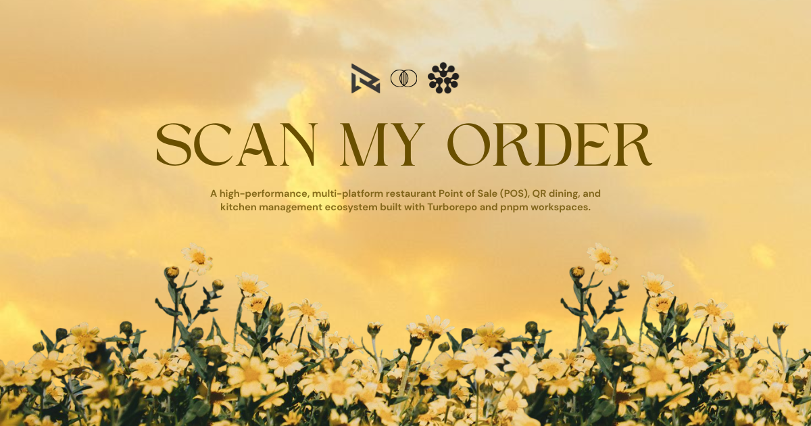

<div align="center">
  
  <h1>Scan My Order</h1>
  <p><strong>Next-Generation Multi-Platform Restaurant POS, QR Dining, and Kitchen Management Ecosystem</strong></p>
</div>

<p align="center">
  
</p>

---

## 🏗️ System Architecture & Services

```text
scan-my-order/
├── apps/
│   ├── backend/         # Express REST API (PostgreSQL + Prisma)
│   ├── web/
│   │   ├── admin/       # Master Store Configuration & Analytics
│   │   ├── operations/  # Live Table Map, POS & Order Dispatch
│   │   ├── menu/        # Guest QR Menu & Mobile Ordering
│   │   └── marketing/   # Showcase & Landing Page
│   └── native/
│       ├── kitchen/     # Kitchen Display System (KDS) Tablet
│       └── staff/       # Waiter Handheld POS Companion
└── packages/
    ├── assets/          # Shared Branding Assets (Favicon, Logo, OG Banner)
    ├── db/              # Prisma schema & singleton client
    ├── types/           # Shared TypeScript interfaces & Zod schemas
    ├── eslint-config/   # Shared ESLint rules
    └── typescript-config/# Shared TS configuration presets
```

---

## 🎨 Shared Brand Assets (`@repo/assets`)

The `packages/assets` package serves as the single source of truth for branding media across all web and mobile apps:

| Asset | File | Description & Usage |
| :--- | :--- | :--- |
| **Favicon** | [`favicon.svg`](packages/assets/favicon.svg) | Applied as default `<link rel="icon">` across all web apps (`admin`, `operations`, `menu`, `marketing`) and native Expo web build. |
| **Dark Logo (Light Mode)** | [`logo.png`](packages/assets/logo.png) | High-resolution black silhouette logo for light backgrounds and theme auto-switching. |
| **White Logo (Dark Mode)** | [`logo-white.png`](packages/assets/logo-white.png) | Pure white inverted logo with alpha transparency for dark UI headers, dark mode GitHub README, and mobile apps. |
| **OG Image** | [`og-image.png`](packages/assets/og-image.png) | Open Graph social sharing preview banner configured in `<meta property="og:image">`. |

```typescript
// Example: Importing shared assets in TypeScript / React
import logoWhiteUrl from "@repo/assets/logo-white.png";
```

---

## ⚡ Application Ports & Stack

| Application | Path | Port | Technology |
| :--- | :--- | :--- | :--- |
| **Backend API** | `apps/backend` | **8080** | Node.js, Express, TypeScript, Zod, Prisma |
| **Admin Portal** | `apps/web/admin` | **3000** | Vite, React 18, Tailwind CSS, `shadcn/ui` |
| **Operations POS** | `apps/web/operations` | **3001** | Vite, React 18, Tailwind CSS, `shadcn/ui` |
| **Customer QR Menu**| `apps/web/menu` | **3002** | Vite, React 18, Tailwind CSS, Mobile-First |
| **Marketing Site** | `apps/web/marketing` | **3003** | Vite, React 18, Tailwind CSS |
| **Kitchen KDS** | `apps/native/kitchen`| **8081** | Expo 52, React Native, NativeWind v4 |
| **Staff Handheld** | `apps/native/staff` | **8082** | Expo 52, React Native, NativeWind v4 |

---

## 🚀 Quick Start

### 1. Prerequisites
- **Node.js** `>= 20.0.0`
- **pnpm** `>= 11.0.0`
- **PostgreSQL** instance (Local or Hosted e.g., Render / Supabase)

### 2. Setup & Database
```bash
# 1. Install dependencies
pnpm install

# 2. Configure environment
cp .env.example .env

# 3. Generate Prisma client
pnpm db:generate

# 4. Push schema to database
pnpm db:push
```

### 3. Development
```bash
# Start all 7 services concurrently on assigned ports
pnpm dev

# Build all applications and packages
pnpm build

# Run linter
pnpm lint
```

---

## 📄 License
MIT © Webrizen AI Labs Pvt Ltd
